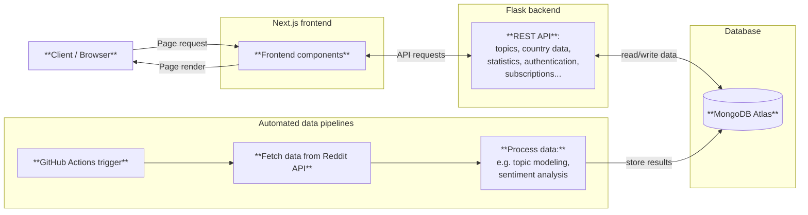

# Reddit Trend Analyzer 

🔥 **No more endless scrolling** – discover what’s trending online and how people feel about it, at a glance

🔍 **Reddit Trend Analyzer** automatically collects and analyzes popular posts from multiple subreddits. Using **topic modeling**, **summarization**, and **sentiment analysis**, it reveals what people are discussing, their opinions, and how conversations evolve over time.

💡 Analyses run via **GitHub Actions**, with processed insights stored in **MongoDB Atlas**

🎓 Developed for **Software Development Project II** at Haaga-Helia University of Applied Sciences

📅 **Project timeline**: August – November 2025 (4 development sprints)

 

<strong>Table of contents</strong>

    
- [Tech stack](#-tech-stack)
- [Full stack application overview](#-full-stack-application-overview)
- [Main features](#-main-features)
- [User stories](#-user-stories)
- [Team and roles](#-team-and-roles)
- [Contributing](#-contributing)

## 🛠 Tech stack
- **Backend:** Flask & Python
- **Frontend:** Next.js & TypeScript

## 🧩 Full stack application overview

For more detailed architecture charts, see backend and frontend repositories.

## ⭐ Main features

- Discover trending topics across multiple categories (news, tech, entertainment…)
- View the sentiment of discussions (positive, negative, neutral)
- Track how trends change over time with interactive charts
- Filter topics by category or sentiment
- Explore discussion trends across different countries on a map
- Log in and subscribe to get automated analyses for your favorite subreddit

## 📌 User stories

✅ Done | 🟡 Partially done | 🔄 In progress | 🚫 Not planned | 💡 Development idea

| #  | User story | Notes | Sprint | Status |
|----|------------|-------|--------|--------|
| 1  | As a user, I want trending Reddit topics in one place, so that I can quickly see what’s popular. | Initial version with real-time Reddit requests and analysis (BERTopic) developed in Sprint 1. Automated data processing (via GitHub Actions) and database integration added in Sprint 2. | Sprint 1, Sprint 2 | ✅ |
| 2  | As a user, I want to view the sentiment of public discussions (positive, negative, neutral), so that I can understand people’s opinions on a topic. | Implemented with the VADER model in Sprint 1. The same sentiment analysis approach was later reused in new features. | Sprint 1 | ✅ |
| 3  | As a user, I want to see how opinions on a topic change over time, so I can observe how the discussion develops. | Implemented at the subreddit level in Sprint 2. The current data processing and database architecture make topic-level implementation too difficult, so it is no longer planned. | Sprint 2 | 🟡 |
| 4  | As a user, I want to search for specific topics, so that I can find opinions on topics I'm interested in. | Excluded due to architectural constraints — the backend runs scheduled analyses instead of real-time queries, which makes search impractical. | | 🚫 |
| 5  | As a user, I want to save topics to my account, so that I can follow them and get updates easily. | Added user authentication and subreddit subscription feature with daily automated analyses (via GitHub Actions). | Sprint 3 | ✅ |
| 6  | As a user, I want to receive a weekly summary of my saved topics (via email, for example), so that I can stay updated easily. | Not implemented due to time constraints. Possible idea for future development. | | 💡 |
| 7  | As a user, I want to see trending topics displayed on a map, so that I can compare public discussion in different countries. | Initial version with real-time Reddit requests implemented in Sprint 2. Automated data processing (via GitHub Actions) and database integration added in Sprint 3. | Sprint 2, Sprint 3 | ✅ |
| 8  | As a user, I want to view results from multiple sentiment analysis models, so that I can evaluate their accuracy and reliability. | Not implemented due to time constraints. Great idea for future development. | | 💡 |
| 9  | As a user, I want to receive notifications when a topic I follow starts trending again, so that I don’t miss important updates. | Not implemented due to time constraints. Possible idea for future development. | | 💡 |
| 10 | As a user, I want to filter trending topics by category (e.g., politics, technology, sports), so that I can focus on areas that interest me most. | Category = subreddit. User can view analysis results from a predefined list of subreddits. | Sprint 2 | ✅ |
| 11 | As a user, I want to filter trending topics by time (e.g. 24 hours, 2 days, 7 days), so that I can get accurate data on the timespan I'm interested in. | Excluded due to architectural constraints — the current database structure and data retrieval logic do not support time-based filtering efficiently. Also, the feature would require large updates to frontend. | | 🚫 |
| 12 | As a user, I want to see a graph of the amount of posts over time per topic, so I can quickly explore the topic's lifecycle in popularity. | Partially implemented as part of user story 3, but only at the subreddit level, not the topic level. | Sprint 2 | 🟡 |
| 13 | As a user, I want to get a short text summary explaining why a given topic is trending, so I can understand the context better and stay up-to-date with popular topics. | Added topic summaries (with Flan-T5) to explain discussion context, though it doesn’t explicitly explain *why* the topic is trending. | Sprint 3 | ✅ |
| 14 | As a user, I want to be able to restrict the visibility of results so that I don't see topics that I find boring. | Excluded as unnecessary, since the user can already filter categories in the frontend and simply choose not to view uninteresting topics. | | 🚫 |
| 15 | As a user, I want to be able to filter the visible topics by their sentiment score so that I see positive, negative or neutral topics only. | Added filtering by sentiment score. | Sprint 1 | ✅ |
| 16 | As a user, I want to use the website also with my phone so that I can access content anytime and anywhere. | Responsive layout improved in Sprint 4, with minor issues potentially remaining. | Sprint 4 | ✅ |
| 17 | As a user, I want the site to have a responsive, modern and stylish design, so that my user experience is smooth and enjoyable. | Initial version in Sprint 2, and small enhancements added in Sprint 4. | Sprint 2, Sprint 4 | ✅ |
| 18 | As a user, I want to see a clear description of how the data is processed and analysed, so that I can better understand and trust the results. | Not implemented due to time constraints. Great idea for future development. | | 💡 |
| 19 | As a developer, I want to perform testing, so that I can ensure the quality of my product. | Some tests were implemented in both backend and frontend, but the coverage is not comprehensive. If the project would continue, expanding the testing scope is recommended. | Sprint 3, Sprint 4 | 🟡💡 |

## 👥 Team and roles
**The team**: [Kirsi](https://github.com/kkivilahti), [Musakhan](https://github.com/MusaMamas), [Laura](https://github.com/makinla), [Niklas](https://github.com/niklasovaska) & [Artur](https://github.com/dmas5)
  
This project was carried out as part of the **Software Development Project II** course at Haaga-Helia University of Applied Sciences by a 5-member team. The team had no fixed responsibilities and everyone was allowed to choose tasks according to their interests. While there were no permanent backend or frontend teams, roles naturally emerged: **Kirsi, Laura, and Artur** primarily worked on the backend, whereas **Musakhan and Niklas** focused on the frontend.

Sprint-specific responsibilities were as follows:

Sprint 1

| Team Member | Area     | Tasks |
|-------------|----------|-------|
| **Kirsi**   | Backend  | - Connect to Reddit API and create initial data fetch for selected subreddits - Perform topic modeling with BERTopic - Documentation |
| **Laura**   | Backend  | - Optimize Reddit API connection using asyncio semaphore - Perform sentiment analysis with VADER - Documentation |
| **Artur**   | Backend  | - Set up initial REST API with CORS configurations |
| **Niklas**  | Frontend | - Initialize Next.js app - Fetch data from backend - Display sentiment analysis results in UI - Documentation |
| **Musakhan**| Frontend | - Display trending topics in the UI - Implement topic filtering based on sentiment values (positive, negative, neutral) - Add error handling and loading states |

Sprint 2

| Team Member | Area     | Tasks |
|-------------|----------|-------|
| **Kirsi**   | Backend  | - Automate data processing with GitHub Actions - Implement backend logic for category filtering: automated analysis pipeline for selected categories, database integration, and API endpoint for retrieving latest data - Convert topic labels into a more readable form - Documentation |
| **Laura**   | Backend  | - Create backend logic for the map feature: language translation with Flan-T5 and a new API endpoint with real-time Reddit requests and analysis - Documentation |
| **Artur**   | Backend  | - Connect to database - Research options for app deployment |
| **Niklas**  | Backend Frontend | - Plan how to implement over-time analysis - Develop backend logic for over-time analysis: implement MongoDB aggregation queries to calculate statistics for stored data, and add corresponding API endpoints - Create initial version of the map feature in frontend - Display sentiment analysis results with charts - Documentation |
| **Musakhan**| Frontend | - Implement category filtering in frontend - Display over-time analysis results with charts - Design and implement a stylish and responsive UI |

Sprint 3

| Team Member | Area     | Tasks |
|-------------|----------|-------|
| **Kirsi**   | Backend  | - Automate data processing and integrate database for the map feature - Design and implement subreddit subscription feature in backend: automated data processing for subscribed subreddits, database integration, and API endpoints - Further develop existing data pipelines - Documentation |
| **Laura**   | Backend  | - Enhance topic modeling results with representation model and topic reduction - Implement topic summarization using Flan-T5 - Design and implement user authentication in backend: authentication API endpoints, database integration, and basic security and validation - Documentation |
| **Artur**   | Backend  | - Organize REST API structure |
| **Niklas**  | Frontend | - Implement subreddit subscription feature in frontend - Research testing options - Begin testing on the frontend side |
| **Musakhan**| Frontend | - Update the map in frontend after backend changes - Implement user authentication logic in frontend and create login/register pages - Display topic summaries in the frontend |

Sprint 4

    
| Team Member | Area     | Tasks |
|-------------|----------|-------|
| **Kirsi**   | Backend  | - Implement backend testing using Pytest - Automate test execution and Allure test report generation/publishing with GitHub Actions - Add licenses - Documentation |
| **Laura**   | Backend  | - Deploy backend on Render - Finalize user authentication feature in backend - Review application security - Documentation |
| **Artur**   | Backend  | - Research license options - Research database schemas |
| **Niklas**  | Frontend | - Deploy frontend on Vercel - Finalize subscription feature in frontend - Implement frontend testing using mainly Playwright - Documentation |
| **Musakhan**| Frontend | - Finalize UI and improve responsiveness - Improve user authentication handling in frontend |

## 🤝 Contributing

This project is released under the Apache 2.0 License.  

We welcome community contributions! You can:

1. **Fork** this repository to create your own version  
2. **Experiment** with new features or improvements  
3. **Share** your ideas with the community  

⚠️ Please note: the main repository is kept stable. Pull requests will be reviewed carefully, so for most changes, forking is recommended.

