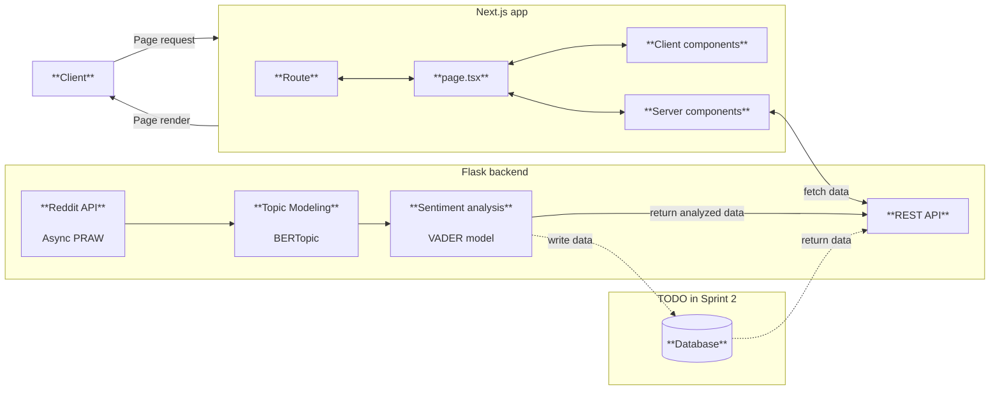

# Reddit Trend Analyzer 

🔥 **No more endless scrolling** – discover what’s trending online and how people feel about it, at a glance

🔍 This application fetches top Reddit posts and uses sentiment analysis to show whether discussions are positive, negative, or neutral

🎓 Developed for **Software Development Project II** at Haaga-Helia University of Applied Sciences

🚧 Currently in early development

## 🛠 Tech Stack
- **Backend:** Flask & Python
- **Frontend:** Next.js & TypeScript

## 🧩 Full Stack Application Overview

## 📌 User Stories
| #  | User story | Notes | Sprint | Status |
|----|------------|-------|--------|--------|
| 1  | As a user, I want trending Reddit topics in one place, so that I can quickly see what’s popular. | | Sprint 1 | ✅ |
| 2  | As a user, I want to view the sentiment of public discussions (positive, negative, neutral), so that I can understand people’s opinions on a topic. | | Sprint 1 | ✅ |
| 3  | As a user, I want to see how opinions on a topic change over time, so I can observe how the discussion develops. | | Sprint 2 | |
| 4  | As a user, I want to search for specific topics, so that I can find opinions on topics I'm interested in. | | | |
| 5  | As a user, I want to save topics to my account, so that I can follow them and get updates easily. | | | |
| 6  | As a user, I want to receive a weekly summary of my saved topics (via email, for example), so that I can stay updated easily. | | | |
| 7  | As a user, I want to see trending topics displayed on a map, so that I can compare public discussion in different countries. | | Sprint 2 | |
| 8  | As a user, I want to view results from multiple sentiment analysis models, so that I can evaluate their accuracy and reliability. | | | |
| 9  | As a user, I want to receive notifications when a topic I follow starts trending again, so that I don’t miss important updates. | | | |
| 10 | As a user, I want to filter trending topics by category (e.g., politics, technology, sports), so that I can focus on areas that interest me most. | category = subreddit | Sprint 2 | |
| 11 | As a user, I want to filter trending topics by time (e.g. 24 hours, 2 days, 7 days), so that I can get accurate data on the timespan I'm interested in. | | | |
| 12 | As a user, I want to see a graph of the amount of posts over time per topic, so I can quickly explore the topic's lifecycle in popularity. | | | |
| 13 | As a user, I want to get a short text summary explaining why a given topic is trending, so I can understand the context better and stay up-to-date with popular topics. | | Sprint 2 | |
| 14 | As a user, I want to be able to restrict the visibility of results so that I don't see topics that I find boring. | | | |
| 15 | As a user, I want to be able to filter the visible topics by their sentiment score so that I see positive, negative or neutral topics only. | | Sprint 1 | ✅ |
| 16 | As a user, I want to use the website also with my phone so that I can access content anytime and anywhere. | | | |
| 17 | As a user, I want the site to have a responsive, modern and stylish design, so that my user experience is smooth and enjoyable. | | Sprint 2 | |
| 18 | As a user, I want to view discussions on trending news topics, so I can see which topics gain most attention and how people feel about them. | backup option | | |

## 📈 Planned Features
Based on user stories:
- View top trending Reddit topics on a single page
- Analyze the sentiment of discussions (positive, negative, neutral)
- Track how opinions change over time and visualize trends
- Filter topics by category, sentiment, or time range
- Compare trending topics across different countries on a map

## 👥 Team and Roles
**The team**: [Kirsi](https://github.com/kkivilahti), [Musakhan](https://github.com/MusaMamas), [Laura](https://github.com/makinla), [Niklas](https://github.com/niklasovaska) & [Artur](https://github.com/dmas5)
  
Team members rotate roles and tasks each sprint to ensure a comprehensive learning experience. Currently, we have no permanent backend or frontend teams, allowing everyone to work on different tasks based on interests.

Sprint-specific responsibilities are listed below.

Sprint 1

| Team Member | Area     | Tasks |
|-------------|----------|-------|
| **Kirsi**   | Backend  | Connect to Reddit API Topic modeling with BERTopic Documentation |
| **Laura**   | Backend  | Optimize Reddit API connection Sentiment analysis with VADER Documentation |
| **Artur**   | Backend  | REST API with CORS configurations |
| **Niklas**  | Frontend | Next.js app base Fetch data from backend Display sentiment analysis results in UI Documentation |
| **Musakhan**| Frontend | Display trending topics in UI Filter topics by sentiment score Error handling and loading states |

Sprint 2

Coming soon

Sprint 3

Coming soon

Sprint 4

Coming soon

